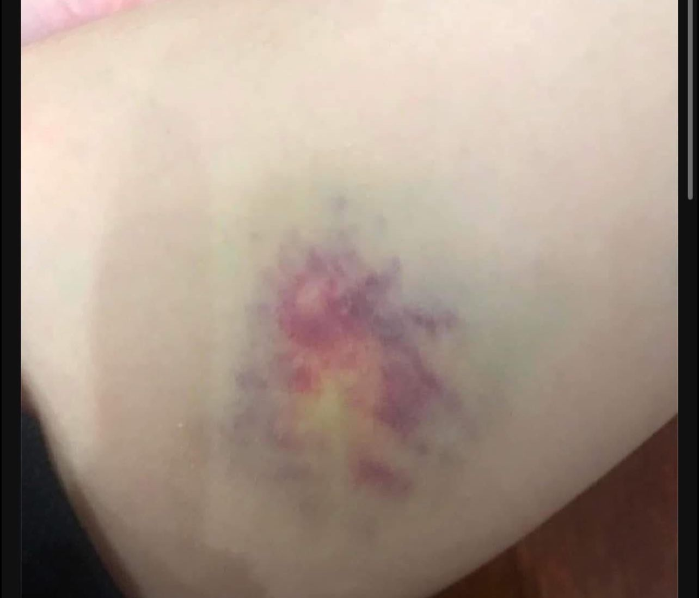

<!-- omit in toc -->
# Nội dung được lấy từ [Box Y Khoa](https://www.facebook.com/BOXYkhoa)

- [“🐕 CHÓ MA CẮN” DƯỚI GÓC NHÌN Y KHOA](#-chó-ma-cắn-dưới-góc-nhìn-y-khoa)
- [‼️ Khi nào cần đi khám?](#️-khi-nào-cần-đi-khám)

# “🐕 CHÓ MA CẮN” DƯỚI GÓC NHÌN Y KHOA
Hiện tượng tự nhiên xuất hiện các vết bầm tím trên cơ thể, trong dân gian Việt Nam, thường được gọi là “chó ma cắn”. Tuy nhiên, hiện tượng này có thể được lý giải theo góc độ y học như sau:

1. Dân gian: “Chó ma cắn”
    - Quan niệm này xuất phát từ niềm tin tâm linh, cho rằng những vết bầm tím không rõ nguyên nhân là do các yếu tố siêu nhiên gây ra, chẳng hạn như hồn ma hoặc thế lực vô hình.
    - Thường được dùng để giải thích khi khoa học hoặc lý do cụ thể chưa rõ ràng.
2. Góc độ y học:
Các vết bầm tím tự nhiên thường liên quan đến các vấn đề sức khỏe sau:

    - a. Tổn thương mạch máu nhỏ (mao mạch)
      - Các mạch máu nhỏ dưới da có thể bị tổn thương mà không cần một tác động mạnh (ví dụ: vô tình va chạm mà bạn không để ý).
      - Kết quả là máu rò rỉ ra ngoài, tạo thành vết bầm.
    
    - b. Rối loạn đông máu. Một số bệnh lý như:
      - **Thiếu vitamin K**: Vitamin K rất cần thiết cho quá trình đông máu. Thiếu hụt có thể gây dễ bầm tím.
      - Rối loạn chức năng tiểu cầu hoặc máu không đông đúng cách (**như bệnh Hemophilia**).
      - **Thiếu hụt hoặc giảm tiểu cầu**: Gặp trong các bệnh lý như sốt xuất huyết, lupus, hoặc tác dụng phụ của thuốc. 
    
    - c. Bệnh lý về gan
      - Gan đóng vai trò sản xuất protein đông máu. Nếu gan hoạt động không tốt (như trong viêm gan hoặc xơ gan), cơ thể dễ xuất hiện bầm tím.
    
    - d. Lão hóa
      - Ở người cao tuổi, da mỏng hơn và các mạch máu dễ tổn thương hơn. Điều này khiến các vết bầm xuất hiện thường xuyên hơn.
   
   - e. Tác dụng phụ của thuốc
     - Một số loại thuốc như **aspirin, warfarin, hoặc thuốc chống đông máu khác** có thể làm tăng nguy cơ bầm tím.
    
    - f. Thiếu hụt vitamin và khoáng chất
     - **Thiếu vitamin C** (gây bệnh Scorbut), **vitamin B12**, hoặc **sắt** có thể khiến mạch máu dễ bị tổn thương.

# ‼️ Khi nào cần đi khám?
**Nếu vết bầm tím:**
- Xuất hiện thường xuyên và không rõ nguyên nhân.
- Không tự khỏi sau vài ngày đến một tuần.
- Đi kèm triệu chứng khác như chảy máu nướu, chảy máu mũi, hoặc mệt mỏi bất thường.
  
Trong trường hợp này, bạn nên đến cơ sở y tế để được thăm khám và xét nghiệm chuyên sâu.