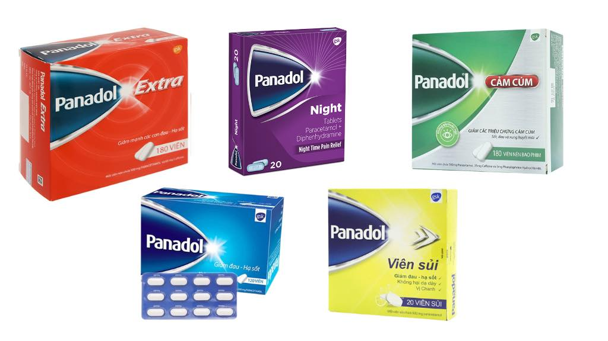

# Nội dung được lấy từ [Box Y Khoa](https://www.facebook.com/BOXYkhoa)

# 📝 PHÂN BIỆT CÁC LOẠI PANADOL GIẢM ĐAU - HẠ SỐT

Panadol là một trong những thuốc giảm đau, hạ sốt nổi tiếng nhất thế giới, được tin dùng từ trẻ em đến người lớn, phụ nữ mang thai đến người bệnh mạn tính. Dễ uống, ít gây kích ứng dạ dày, lại dễ mua. 
Nhưng… Panadol giờ không còn chỉ là “viên thuốc trắng xanh” ngày xưa. Trên thị trường có cả Panadol đỏ, vàng, xanh lá, cảm cúm ngày, cảm cúm đêm, đủ màu như hộp bút chì, nhưng tác dụng và thành phần thì khác nhau:
- Có loại chỉ giảm đau hạ sốt, nhẹ nhàng.
- Có loại lại thêm caffeine, kích thích tỉnh táo, uống tối là… thức trắng đêm.
- Có loại dành cho cảm cúm ban đêm, uống ban ngày là gục trên bàn làm việc.
- Có loại không dùng được cho người cao huyết áp, người mất ngủ, phụ nữ có thai.

Vậy nên, nhìn đúng màu, chọn đúng thuốc, uống đúng lúc mới là người tiêu dùng thông minh. Cùng BOX Y Khoa phân biệt rạch ròi từng loại Panadol để lựa chọn cho đúng nhé!

## 🔵 PANADOL XANH (Regular)
Thành phần: Paracetamol 500mg

✅ Ưu điểm:
- Giảm đau, hạ sốt cơ bản
- Không gây buồn ngủ
- Dễ dùng, an toàn với nhiều đối tượng

❌ Nhược điểm:
- Hiệu quả giảm đau không mạnh với cơn đau nặng

👉 Phù hợp với người lớn và trẻ lớn khi sốt, đau nhẹ đến trung bình

Có thể dùng cho phụ nữ mang thai, người bệnh mạn tính

## 🔴 PANADOL ĐỎ (Extra)
Thành phần: Paracetamol 500mg + Caffeine 65mg

✅ Ưu điểm:

- Giảm đau tốt hơn, nhất là đau đầu, đau kinh
- Không gây buồn ngủ, giúp tỉnh táo

❌ Nhược điểm:
- Có thể gây mất ngủ nếu uống buổi tối
- Không phù hợp với người lo âu, mất ngủ, cao huyết áp. Tránh dùng sau 17h để khỏi trằn trọc ban đêm.

👉 Dùng khi đau đầu do căng thẳng, cần tỉnh táo làm việc

## 🟢 PANADOL CẢM CÚM
Thành phần: Paracetamol + Caffeine + Phenylephrine

✅ Ưu điểm:
- Vừa hạ sốt, giảm đau, vừa thông mũi, giảm nghẹt
- Giúp tỉnh táo, không gây buồn ngủ

❌ Nhược điểm:
- Không thích hợp dùng buổi tối
- Không dùng cho người cao huyết áp, tim mạch

👉 Dùng khi cảm cúm vào ban ngày, có nghẹt mũi, mệt mỏi. Ai cảm mà cần phải đi làm việc, học tập, đi thi thì dùng cái này.

## 🟣 PANADOL CẢM CÚM BAN ĐÊM (Night)
Thành phần: Paracetamol + Diphenhydramine + Phenylephrine

✅ Ưu điểm:
- Giảm đau, hạ sốt, thông mũi
- Giúp dễ ngủ, giảm mệt mỏi về đêm

❌ Nhược điểm:
- Gây buồn ngủ mạnh, không nên lái xe hoặc làm việc máy móc sau khi uống
- Không bán ở Việt Nam 🙂 

👉 Chỉ nên dùng vào ban đêm để dễ ngủ.

# 📕KẾT LUẬN:
1. **Giảm đau chỉ là giải pháp tạm thời**, hãy tìm và điều trị nguyên nhân gốc. 
2. Panadol tuy tiện lợi nhưng **không nên lạm dụng**. Dù là thuốc không kê đơn, paracetamol nếu dùng quá liều vẫn có thể gây tổn thương gan nặng, thậm chí dẫn đến suy gan cấp. Uống quá nhiều trong thời gian ngắn hoặc dùng kéo dài đều nguy hiểm.
3. **Phụ nữ có thai, đang cho con bú hoặc người có bệnh gan** cần tham khảo ý kiến bác sĩ trước khi dùng bất kỳ dạng Panadol nào. 

Một số loại chứa thêm chất gây co mạch, kích thích thần kinh, hoặc kháng histamin có thể không an toàn. Dùng sai thuốc trong nhóm này đôi khi nguy hiểm hơn cả việc không uống.