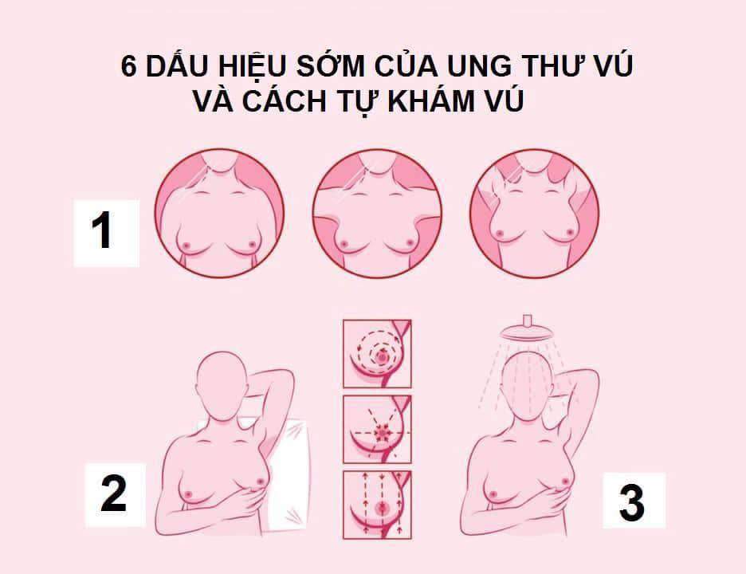

<!-- omit in toc -->
# Nội dung được lấy từ [Box Y Khoa](https://www.facebook.com/BOXYkhoa) và nhóm [BOX Kiến Thức Y Khoa](https://www.facebook.com/groups/howthebodywork.mg)

- [NHỮNG DẤU HIỆU SỚM CỦA UNG THƯ VÚ](#những-dấu-hiệu-sớm-của-ung-thư-vú)
- [NHƯ THẾ NÀO LÀ “MỘT CHIẾC VÚ BÌNH THƯỜNG”?](#như-thế-nào-là-một-chiếc-vú-bình-thường)
- [VẬY NÊN KHÁM VÚ BẰNG CÁCH NÀO?](#vậy-nên-khám-vú-bằng-cách-nào)
  - [CÁCH TỰ KHÁM VÚ](#cách-tự-khám-vú)

Ở Việt Nam ung thư vú đứng hàng đầu về tỷ lệ mắc và hàng thứ 3 về tỷ lệ tử vong ở nữ giới. Mặc dù ung thư vú thường không có triệu chứng trong giai đoạn đầu, nhưng việc phát hiện kịp thời có thể giúp việc điều trị trở nên dễ dàng và hiệu quả cao hơn.

Một khối u ở vú là triệu chứng biểu hiện phổ biến nhất và trong bài viết này, chúng ta sẽ khám phá các dấu hiệu, triệu chứng ban đầu của ung thư vú và nên khám vú như thế nào để không bỏ sót nhé!

# NHỮNG DẤU HIỆU SỚM CỦA UNG THƯ VÚ
Ngay từ sớm, một người có thể nhận thấy sự thay đổi ở vú khi họ khám vú hàng tháng hoặc khi **cơn đau bất thường**, kéo dài và tăng dần về mức độ.

Các dấu hiệu sớm của ung thư vú có thể là:
- Thay đổi hình dạng của núm vú
- Đau vú kéo dài không giảm đi sau kỳ kinh tiếp theo
- Một khối u mới không biến mất sau kỳ kinh tiếp theo của bạn
- Tiết dịch núm vú từ một bên vú có màu trong, đỏ, nâu hoặc vàng
- Nổi mẩn đỏ không rõ nguyên nhân, sưng tấy, kích ứng da, ngứa ngáy hoặc phát ban trên vú
- Sưng tấy hoặc một khối u xung quanh xương đòn hoặc dưới cánh tay
- 
Khi bạn phát hiện **một khối cứng với các cạnh không đều** có nhiều khả năng là ung thư!

# NHƯ THẾ NÀO LÀ “MỘT CHIẾC VÚ BÌNH THƯỜNG”?
Thực sự thì không có tiêu chuẩn nào là một bộ ngực “bình thường” cả. Ngực của mỗi người đều khác nhau. Vì vậy, khi chúng ta nói về một bộ ngực bình thường, tức là nó **bình thường đối với bạn**. Điều đó nghĩa là bộ ngực mà bạn vẫn sở hữu bấy lâu, ngắm nghĩa, sờ nắn nó mỗi ngày, không có thay đổi đáng kể nào.

Tuy nhiên có một điều cần lưu ý rằng **việc thay đổi vú trong thời kỳ rụng trứng là điều thường thấy**. Một số triệu chứng có thể là:
- sưng tấy
- đau nhức
- u cục

Hãy yên tâm là **triệu chứng này sẽ hết sau khi bạn bắt đầu có kinh nguyệt trở lại**. (hoặc không) 🙂

# VẬY NÊN KHÁM VÚ BẰNG CÁCH NÀO?
Không nhất thiết phải đến bệnh viện hoặc phòng khám thường xuyên mới có thể khám, bạn hoàn toàn có thể tự kiểm tra cặp dú của mình.

Các chuyên gia khuyến cáo, từ tuổi 20, **phụ nữ nên tự kiểm tra vú mỗi tháng 1 lần**, **ngay sau khi hết chu kỳ kinh nguyệt**. Ngoài ra từ **40 trở lên**, **nên chụp X- quang tuyến vú mỗi năm 1-2 lần**.

Việc kiểm tra thường xuyên có thể giúp bạn biết được bộ ngực của mình trông như thế nào, quen với nó và dễ dàng nhận ra những thay đổi bất thường nếu có.

Đây là những gì cần quan sát trong một lần tự khám:
- sự khác biệt về kích thước, hình dạng hoặc màu sắc của dú
- da bị lõm hoặc phồng lên
- mẩn đỏ, đau nhức, phát ban hoặc sưng tấy
- tụt núm vú, tiết dịch bất thường

## CÁCH TỰ KHÁM VÚ

1. Nhìn thẳng vào gương:
   
    Thực hiện các động tác với tay sau: (Hình 1)
    - Để tay bình thường
    - Tay giơ lên ​​trên hoặc sau đầu của bạn
    - Tay chống hông và căng cơ ngực
    
    Hãy chú ý đến:
    - Bất kỳ thay đổi nào về kích thước hoặc hình dạng của vú
    - Bất kỳ vết lõm nào của da
    - Bất kỳ thay đổi nào của của núm vú
    - Bất kỳ dịch gì chảy ra từ núm vú (bằng cách bóp nhẹ)
  
2. Nằm xuống:
   
    Đặt gối dưới vai trái với tay trái dưới đầu (Hình 2)
    - Dùng ba ngón tay giữa của bàn tay phải, giữ phẳng các ngón tay để kiểm tra ngực trái.
    - Ấn mạnh, sử dụng các chuyển động tròn nhỏ để cảm nhận các cục u.
    - Bắt đầu từ mép ngoài của vú, đi vào trong theo vòng tròn.
    - Kiểm tra toàn bộ vú, nách và sau núm vú.
    - Lặp lại các bước này bằng tay trái để kiểm tra vú phải.
  
3. Trong phòng tắm:
    (Hình 3)
    - Nâng cánh tay phải lên trên đầu
    - Xà phòng tay trái và kiểm tra ngực phải như được mô tả trong "tư thế nằm"
    - Lặp lại các bước bằng cách sử dụng tay phải để kiểm tra ngực trái
  
**Đặc biệt**, hãy luôn nhớ rằng:
1. Không ai hiểu rõ về ngực của bạn hơn bạn.
2. Tự khám vú thường xuyên 1 tháng/ lần sẽ giúp bạn tự tầm soát ung thư vú tốt.
3. Nếu bạn không làm được điều số 2, bạn có thể nhờ bạn trai của bạn
4. Bạn trai của bạn cũng có thể bị ung thư vú 🙂
5. Đừng quên chia sẻ đến người yêu thương nhé!
_______________________
*Nguồn tham khảo: Healthline, Webmd